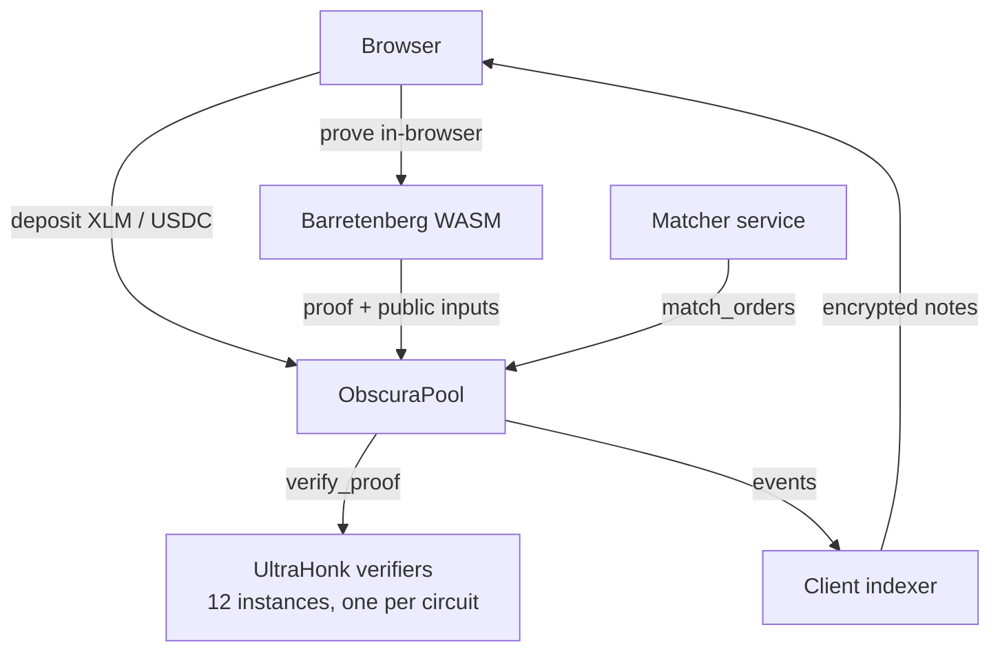

# Obscura

**Private money on Stellar.** Deposit XLM or USDC into a shielded pool, hold balances nobody can
see, pay someone without revealing the amount, trade on a dark pool, and borrow against private
collateral — every exit from the shielded layer gated by a zero-knowledge proof verified inside a
Soroban smart contract.

Nothing here is trusted. Withdraw, transfer, order placement, matching, and every lending action
each require a real Noir/UltraHonk proof that the contract checks on-chain. Without a valid proof,
no funds move.

Supported assets: **XLM** and **USDC**. Network: **Stellar Testnet**.

---
## demo video: [youtube](https://youtu.be/V784qyovn18)
## live demo: [vercel](https://obscura-frontend-eight.vercel.app/)
## feedback form: [click here](https://docs.google.com/forms/d/e/1FAIpQLSdAN9N9lLViBQpSj_Su7jhe32nQDi7kn8PdqYI_jnYqXfXXpQ/viewform?usp=publish-editor)
## Feedback Response: [google sheet](https://docs.google.com/spreadsheets/d/1ZJTks1jdDFqe7BxHqkU9mMksBGCsnJjBxanI8mWsVzE/edit?usp=sharing)
## The app


| Swap — the sealed book | Receive — your cipher |
|---|---|
|  |  |


---

## Contracts
### Core

| Contract | ID | Stellar Lab |
|---|---|---|
| **ObscuraPool** | `CC6VTQPPA7RB7S5NJXLHV3LNYOOARXRTJEMLUT32ZABIRQEUWESGPOJI` | [open](https://lab.stellar.org/smart-contracts/contract-explorer?$=network$id=testnet&label=Testnet&horizonUrl=https:////horizon-testnet.stellar.org&rpcUrl=https:////soroban-testnet.stellar.org&passphrase=Test%20SDF%20Network%20/;%20September%202015;&smartContracts$explorer$contractId=CC6VTQPPA7RB7S5NJXLHV3LNYOOARXRTJEMLUT32ZABIRQEUWESGPOJI) |

### Proof verifiers

One `rs-soroban-ultrahonk` instance per circuit, each bound to that circuit's verifying key.

| Circuit | ID | Stellar Lab |
|---|---|---|
| withdraw | `CAOGOBVQJ2AYQDYG5NU4UX3E3IMRS7OHT2UEDZ4JGMJQG6ACAOCD7FED` | [open](https://lab.stellar.org/smart-contracts/contract-explorer?$=network$id=testnet&label=Testnet&horizonUrl=https:////horizon-testnet.stellar.org&rpcUrl=https:////soroban-testnet.stellar.org&passphrase=Test%20SDF%20Network%20/;%20September%202015;&smartContracts$explorer$contractId=CAOGOBVQJ2AYQDYG5NU4UX3E3IMRS7OHT2UEDZ4JGMJQG6ACAOCD7FED;;) |
| transfer | `CBKI4SXLJP64MRBO7L2CFRLW2HKDOXITH3MZCG22TCPRPVLCUDBN5JZK` | [open](https://lab.stellar.org/smart-contracts/contract-explorer?$=network$id=testnet&label=Testnet&horizonUrl=https:////horizon-testnet.stellar.org&rpcUrl=https:////soroban-testnet.stellar.org&passphrase=Test%20SDF%20Network%20/;%20September%202015;&smartContracts$explorer$contractId=CBKI4SXLJP64MRBO7L2CFRLW2HKDOXITH3MZCG22TCPRPVLCUDBN5JZK;;) |
| place_order | `CDUCCBG6STUU53DV3LQ3R6FYNS65DSP4S2GIYKWIOSK5QFVL2VMXK7NG` | [open](https://lab.stellar.org/smart-contracts/contract-explorer?$=network$id=testnet&label=Testnet&horizonUrl=https:////horizon-testnet.stellar.org&rpcUrl=https:////soroban-testnet.stellar.org&passphrase=Test%20SDF%20Network%20/;%20September%202015;&smartContracts$explorer$contractId=CDUCCBG6STUU53DV3LQ3R6FYNS65DSP4S2GIYKWIOSK5QFVL2VMXK7NG;;) |
| match_orders | `CDXCR3C4EDMYXFG7KHSZUWAUIVZSWTP35PUQFUPGD3Q7V4JKJS2LBFQO` | [open](https://lab.stellar.org/smart-contracts/contract-explorer?$=network$id=testnet&label=Testnet&horizonUrl=https:////horizon-testnet.stellar.org&rpcUrl=https:////soroban-testnet.stellar.org&passphrase=Test%20SDF%20Network%20/;%20September%202015;&smartContracts$explorer$contractId=CDXCR3C4EDMYXFG7KHSZUWAUIVZSWTP35PUQFUPGD3Q7V4JKJS2LBFQO;;) |
| cancel_order | `CD24NXY7C52IFLRHBHSGGTYFBX3HAJHNT22DYP3RY4QX7WJ6YQS66JT5` | [open](https://lab.stellar.org/smart-contracts/contract-explorer?$=network$id=testnet&label=Testnet&horizonUrl=https:////horizon-testnet.stellar.org&rpcUrl=https:////soroban-testnet.stellar.org&passphrase=Test%20SDF%20Network%20/;%20September%202015;&smartContracts$explorer$contractId=CD24NXY7C52IFLRHBHSGGTYFBX3HAJHNT22DYP3RY4QX7WJ6YQS66JT5;;) |

### Lending verifiers

Registered on the pool via `set_lending_verifiers`.

| Circuit | ID | Stellar Lab |
|---|---|---|
| position_open | `CA2MUPW4STKOFS3GFAVUDBLYBETNKDN6EGBMICJIRHB43S4JST5UWT55` | [open](https://lab.stellar.org/smart-contracts/contract-explorer?$=network$id=testnet&label=Testnet&horizonUrl=https:////horizon-testnet.stellar.org&rpcUrl=https:////soroban-testnet.stellar.org&passphrase=Test%20SDF%20Network%20/;%20September%202015;&smartContracts$explorer$contractId=CA2MUPW4STKOFS3GFAVUDBLYBETNKDN6EGBMICJIRHB43S4JST5UWT55;;) |
| borrow | `CAPJQR6LVWVUCCNQHJ244ZIWXMFEZEQEIRCHKI6GHE7SLJSKPPYWRU4X` | [open](https://lab.stellar.org/smart-contracts/contract-explorer?$=network$id=testnet&label=Testnet&horizonUrl=https:////horizon-testnet.stellar.org&rpcUrl=https:////soroban-testnet.stellar.org&passphrase=Test%20SDF%20Network%20/;%20September%202015;&smartContracts$explorer$contractId=CAPJQR6LVWVUCCNQHJ244ZIWXMFEZEQEIRCHKI6GHE7SLJSKPPYWRU4X;;) |
| repay | `CBGPD4LDLRLWAZXSUD6TGSP4O6FN5NOXRCQETAQFJIPRA2KHLPN3UGFA` | [open](https://lab.stellar.org/smart-contracts/contract-explorer?$=network$id=testnet&label=Testnet&horizonUrl=https:////horizon-testnet.stellar.org&rpcUrl=https:////soroban-testnet.stellar.org&passphrase=Test%20SDF%20Network%20/;%20September%202015;&smartContracts$explorer$contractId=CBGPD4LDLRLWAZXSUD6TGSP4O6FN5NOXRCQETAQFJIPRA2KHLPN3UGFA;;) |
| withdraw_collateral | `CD2E7XCGWB5UDFJ73ALHPSP7DKEFQDOKLIKFOLENT5OYWK747GEWGE54` | [open](https://lab.stellar.org/smart-contracts/contract-explorer?$=network$id=testnet&label=Testnet&horizonUrl=https:////horizon-testnet.stellar.org&rpcUrl=https:////soroban-testnet.stellar.org&passphrase=Test%20SDF%20Network%20/;%20September%202015;&smartContracts$explorer$contractId=CD2E7XCGWB5UDFJ73ALHPSP7DKEFQDOKLIKFOLENT5OYWK747GEWGE54;;) |
| solvency_attestation | `CCIER7JVR7XRDO4BLYIVON2M4PXEQN5MDWTJDXVWP2WCNR3YSZP75LTG` | [open](https://lab.stellar.org/smart-contracts/contract-explorer?$=network$id=testnet&label=Testnet&horizonUrl=https:////horizon-testnet.stellar.org&rpcUrl=https:////soroban-testnet.stellar.org&passphrase=Test%20SDF%20Network%20/;%20September%202015;&smartContracts$explorer$contractId=CCIER7JVR7XRDO4BLYIVON2M4PXEQN5MDWTJDXVWP2WCNR3YSZP75LTG;;) |
| supply | `CBSRFPPOHIILJWPAQK7A3SUD25XTSKUJ7PGRSOEIBHDRXXLOATLEIJE2` | [open](https://lab.stellar.org/smart-contracts/contract-explorer?$=network$id=testnet&label=Testnet&horizonUrl=https:////horizon-testnet.stellar.org&rpcUrl=https:////soroban-testnet.stellar.org&passphrase=Test%20SDF%20Network%20/;%20September%202015;&smartContracts$explorer$contractId=CBSRFPPOHIILJWPAQK7A3SUD25XTSKUJ7PGRSOEIBHDRXXLOATLEIJE2;;) |
| redeem | `CCUEOK7JZ6LLLZRCZJF2RMSA7ELEE5B2X3EMDHPCVMIC67EUVC5KDVYN` | [open](https://lab.stellar.org/smart-contracts/contract-explorer?$=network$id=testnet&label=Testnet&horizonUrl=https:////horizon-testnet.stellar.org&rpcUrl=https:////soroban-testnet.stellar.org&passphrase=Test%20SDF%20Network%20/;%20September%202015;&smartContracts$explorer$contractId=CCUEOK7JZ6LLLZRCZJF2RMSA7ELEE5B2X3EMDHPCVMIC67EUVC5KDVYN;;) |

Machine-readable copy: [`deployments.json`](./deployments.json).

---

## Wallets

Connect with any Stellar wallet — Freighter, xBull, Albedo, Rabet, Lobstr — via
[Stellar Wallets Kit](https://github.com/Creit-Tech/Stellar-Wallets-Kit).


Once connected, your shielded total is derived locally from notes only you can decrypt:


Every action is a normal Stellar transaction you can inspect in any explorer:


---

## Wallets

Connect with any Stellar wallet — Freighter, xBull, Albedo, Rabet, Lobstr — via
[Stellar Wallets Kit](https://github.com/Creit-Tech/Stellar-Wallets-Kit).


Once connected, your shielded total is derived locally from notes only you can decrypt:


Every action is a normal Stellar transaction you can inspect in any explorer:


---

## Responsive

The whole app works on mobile.


---

## Tech stack

| Layer | What |
|---|---|
| Circuits | Noir `1.0.0-beta.9`, Barretenberg `0.87.0` (UltraHonk, keccak transcript) |
| Contracts | Rust + Soroban SDK `26.1.0`, target `wasm32v1-none` |
| Verifier | [`rs-soroban-ultrahonk`](https://github.com/yugocabrio/rs-soroban-ultrahonk) — on-chain UltraHonk over BN254 |
| Crypto | Poseidon2 hashing, 32-level Merkle tree, ChaCha20-Poly1305 note encryption |
| SDK | TypeScript, `@noble/*`, `@stellar/stellar-sdk`, built with tsup |
| Frontend | React 18, Vite 5, Tailwind, React Router, TanStack Query, three.js |
| Wallets | Stellar Wallets Kit (Freighter / xBull / Albedo / Rabet / Lobstr) |
| Tooling | pnpm workspaces, Rust stable, Stellar CLI |

---

## Architecture



**How a private payment works.** Your balance is a set of *notes* — commitments in an on-chain
Merkle tree. Only you hold the secrets that open them. To spend, the browser builds a Noir proof
that you know a valid note, that its nullifier is fresh, and that value is conserved. The contract
checks the proof, records the nullifier so it can't be replayed, and inserts the new output
commitments. Amounts and parties never appear on-chain; the encrypted note payload rides along in
the event so the recipient can find it.

```
circuits/noir/   12 Noir circuits (5 core + 7 lending) + shared libs
contracts/       Soroban contracts — obscura-pool, faucet-token, bridge-mpt, obscura-bridge
sdk/             TypeScript client — notes, Poseidon2, Merkle, proofs, tx building
frontend/        React app — Portfolio / Deposit / Pay / Swap / Lend / Receive
matcher/         Off-chain dark-pool order matching
screenshot/      Images used in this README
```

---

## Quick start

```bash
pnpm install                            # workspace deps
pnpm --filter @obscura/sdk build        # frontend imports the SDK from dist/
pnpm --filter frontend dev              # http://localhost:5173
```

Need test USDC? Mint it in the app at `/faucet`.

Contracts:

```bash
cd contracts
cargo test                                      # 22 tests
cargo build --target wasm32v1-none --release    # wasm artifacts
```

## License

MIT
